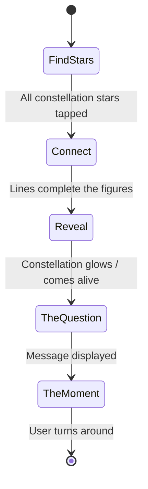
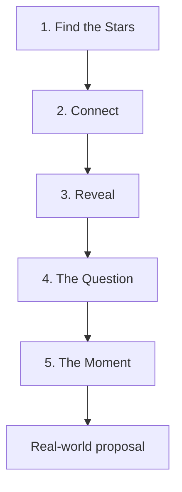

# Proposal Constellation — Minimal Design

**Aesthetic:** Simple. Clear. Magical.  
White glowing stars and thin gold lines on a dark navy/black background.

> *Simple stars. One question. A lifetime together.*

---

## Design 1: Classic Kneel

The primary constellation depicts a marriage proposal: one figure kneeling with a ring, facing a standing figure in a dress silhouette.

Use [Constellation.drawio](Constellation.drawio) (exported as [Constellation.svg](Constellation.svg)) for star positions, connections, colours, and canvas size.

---

## Interactive plan (5 steps)

The experience unfolds in five phases on screen. Each phase builds emotional momentum toward the real-world moment.



### Step 1 — Find the stars

- **Screen:** A field of scattered stars (constellation stars mixed with decoys).
- **Instruction:** *Tap the stars of the constellation.*
- **Interaction:** User taps each star belonging to Classic Kneel.
- **Feedback:** Tapped stars brighten or pulse; decoys may dim or ignore taps.

### Step 2 — Connect

- **Trigger:** As constellation stars are selected, thin gold lines draw between connected nodes.
- **Effect:** The two figures gradually emerge from the star field.
- **Order:** Lines can animate in logical body order (head → limbs) or simultaneously per figure.

### Step 3 — Reveal

- **Trigger:** All nodes connected; constellation complete.
- **Effect:** Full Classic Kneel constellation *comes to life* — glow, subtle shimmer, or gentle pulse on all stars and lines.
- **Duration:** Hold long enough for recognition (~2–4 s) before transitioning.

### Step 4 — The question

- **Transition:** Stars rearrange or new stars appear to spell text.
- **Copy:**

  ```
  ESTELLE
  ♥
  VEUX-TU M'ÉPOUSER ?
  ```

- **Tone:** Personal name, heart, French proposal line — centered, readable, star-formed typography.

### Step 5 — The moment

- **Final instruction** (star text):

  ```
  TURN AROUND
  ♥ ✦
  ```

- **Purpose:** Directs the user to turn toward the proposer in the physical space — the AR/digital experience hands off to the real proposal.

### Step sequence (data flow)



---

## Implementation notes

- Constellation layout, node IDs, edges, and styling: see [Constellation.drawio](Constellation.drawio).
- **Decoy stars (step 1):** Scatter additional low-brightness stars across the field. Only constellation nodes from the draw.io file advance the experience when tapped. Consider a subtle hint after N wrong taps (optional).
- **Typography (steps 4–5):** Star clusters forming letters; heart and sparkle as icon nodes.
